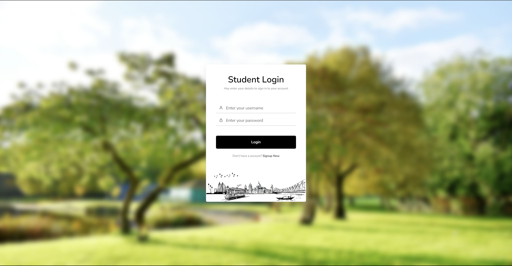
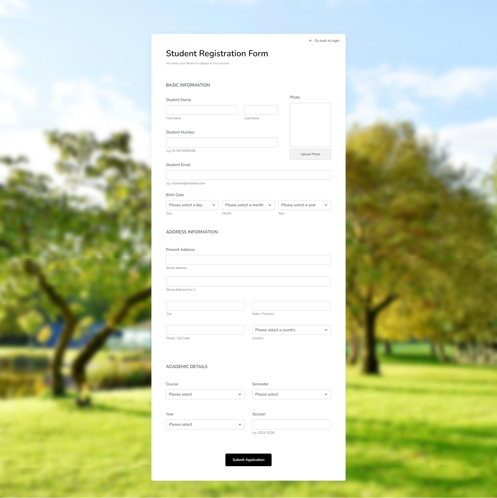
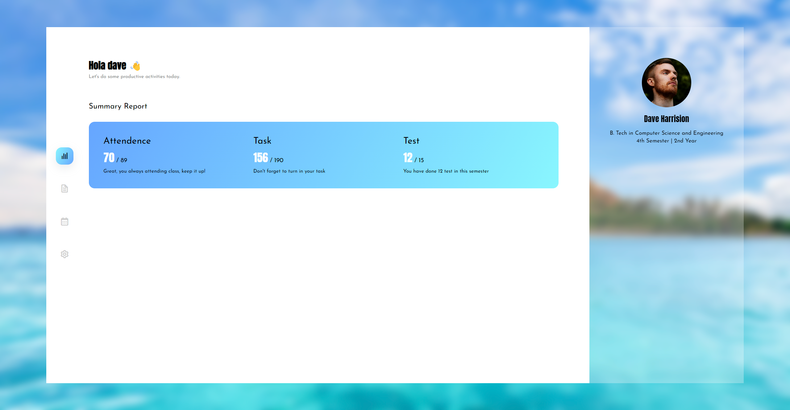
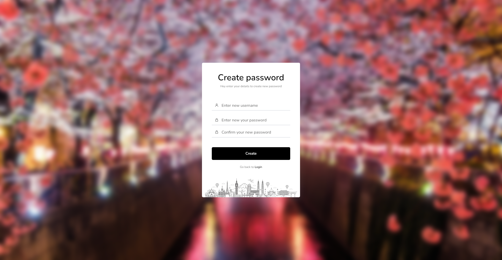

# Student Management System

This project is about simple Student Management System using HTML, CSS, jQuery, mySQL and php.

## Table of Contents
- [index.php](#indexphp)
- [dashboard.php](#dashboardphp)
- [create_password.php](#create_passwordphp)

## index.php
The `index.php` file serves as the landing page of the application. It includes both the login and signup forms for users to access or register for their dashboard.

### Features
- User login form
- User signup form
- Validation for user credentials
- Redirection to the dashboard upon successful login or signup

### Demo Screenshot

## dashboard.php
The `dashboard.php` file is the main interface for logged-in users. It provides access to various features and functionalities of the application.

### Features
- Display user information
- Access to different sections of the application
- Logout functionality

### Demo Screenshot

## create_password.php
The `create_password.php` file is used for creating or resetting user passwords. This is typically used during user registration or when a password reset is required.

### Features
- Form to create a new password
- Password validation and confirmation
- Submission to update the user's password in the database

### Demo Screenshot

## How to Use
1. Clone the repository to your local machine.
2. Ensure you have a local server environment set up (e.g., XAMPP, WAMP).
3. Place the project files in the server's root directory (e.g., `htdocs` for XAMPP).
4. Start the server and navigate to `http://localhost/index.php` to access the application.

## Requirements
- PHP 7.4 or higher
- MySQL Database
- Web server (Apache, Nginx)
